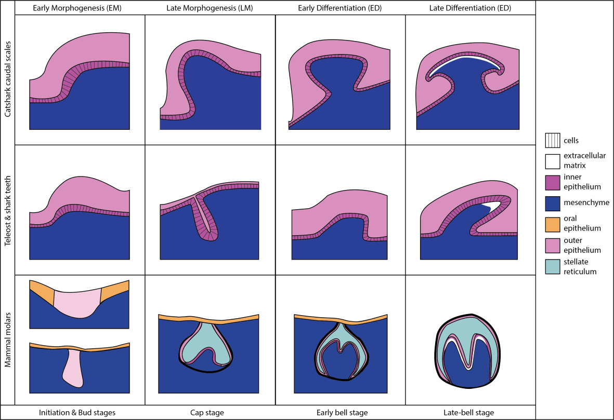

# Genetic-building-of-teeth-and-odontodes

**Review** of gene expression patterns during tooth and odontode development in vertebrates, with a focus on the small-spotted catshark _Scyliorhinus canicula_. 

**Related publication:** 

The role of this database is to have an overview of gene expressions characterizing the development of odontodes and tooth-like structures in vertebrates. We reference gene expressions from _in situ_ hybidizations compared to those tested in _S. canicula_.

## Developmental stages

## Sources

| Year |  Articles, Thesis and Reports | Authors | Ref n° |
|------|-------------------------------|---------|--------|
| 1987 | In vivo expression of mRNA for the Ca++-binding protein SPARC (osteonectin) revealed by _in situ_ hybridization. | Holland _et al_. | 1 |
| 1993 | Transient expression of type III collagen by odontoblasts: developmental changes in the distribution of Pro-α1 (III) and Pro-α1 (I) collagen mRNAs in dental tissues | Lukinmaa _et al_. | 2 |
| 1993 | Identification of BMP-4 as a signal mediating secondary induction between epithelial and mesenchymal tissues during early tooth development | Vainio _et al_. | 3 |
| 1994 | Differential and overlapping expression domains of Dlx-2 and Dlx-3 suggest distinct roles for Distal-less homeobox genes in craniofacial development | Robinson and Mahon | 4 |
| 1995 | Hedgehog and Bmp Genes Are Coexpressed at Many Diverse Sites of Cell–Cell Interaction in the Mouse Embryo | Bitgood and McMahon | 5 |
| 1995a | Midkine (MK), a heparin-binding growth/differentiation factor, is regulated by retinoic acid and epithelial-mesenchymal interactions in the developing mouse tooth, and affects cell proliferation and morphogenesis. | Mitsiadis _et al_. | 6 |
| 1995b | Expression of the heparin-binding cytokines, midkine (MK) and HB-GAM (pleiotrophin) is associated with epithelial-mesenchymal interactions during fetal development and organogenesis | Mitsiadis _et al_. | 7 |
| 1996 | The enamel knot as a signaling center in the developing mouse tooth | Vaahtokari _et al_. | 8 |
| 1997 | Expression patterns of bone morphogenetic proteins (Bmps) in the developing mouse tooth suggest roles in morphogenesis and cell differentiation | Åberg _et al_. | 9 |
| 1997 | Antagonistic Interactions between FGF and BMP Signaling Pathways: A Mechanism for Positioning the Sites of Tooth Formation | Neubüser _et al_. | 10 |
| 1998 | The Shh signalling pathway in tooth development: defects in Gli2 and Gli3 mutants | Hardcastle _et al_. | 11 |
| 1998 | The life history of an embryonic signaling center: BMP-4 induces p21 and is associated with apoptosis in the mouse tooth enamel knot | Jernvall  _et al_. | 12 |
| 1998 | Association of developmental regulatory genes with the development of different molar tooth shapes in two species of rodents | Keränen _et al_. | 13 |
| 1998 | Responsiveness of developing dental tissues to fibroblast growth factors: expression of splicing alternatives of FGFR1, -2, -3, and of FGFR4; and stimulation of cell proliferation by FGF-2, -4, -8, and -9 | Kettunen _et al_. | 14 |
| 1998 | Expression and function of FGFs-4, -8, and -9 suggest functional redundancy and repetitive use as epithelial signals during tooth morphogenesis | Kettunen and Thesleff | 15 |
| 2000 | Associations of FGF-3 and FGF-10 with signaling networks regulating tooth morphogenesis | Kettunen _et al_. | 16 |
| 2000 | Antagonistic signals between BMP4 and FGF8 Define the expression of Pitx1 and Pitx2 in mouse tooth-forming anlage | St Amand _et al_. | 17 |
| 2000 | Edar/Eda interactions regulate enamel knot formation in tooth morphogenesis | Tucker _et al_. | 18 |
| 2000 | Expression of Dlx genes during the development of the murine dentition | Zhao _et al_. | 19 |
| 2001 | TNF signaling via the ligand–receptor pair ectodysplasin and Edar controls the function of epithelial signaling centers and is regulated by Wnt and Activin during tooth organogenesis | Laurikkala _et al_. | 20 |
| 2004 | Runx2 mediates FGF signaling from epithelium to mesenchyme during tooth morphogenesis | Åberg _et al_. | 21 |
| 2004 | Conserved deployment of genes during odontogenesis across osteichthyans | Fraser _et al_. | 22 |
| 2004 | Fgf signaling is required for zebrafish tooth development | Jackman _et al_. | 23 |
| 2006 | Expression of Dlx genes during the development of the zebrafish pharyngeal dentition: evolutionary implications |  Borday-Birraux _et al_. | 24 |
| 2006a | Gene deployment for tooth replacement in the rainbow trout (_Oncorhynchus mykiss_): a developmental model for evolution of the osteichthyan dentition | Fraser _et al_. | 25 |
| 2006b | Developmental and evolutionary origins of the vertebrate dentition: molecular controls for spatio-temporal organisation of tooth sites in osteichthyans | Fraser _et al_. | 26 |
| 2006 | Conservation and divergence of Bmp2a, Bmp2b, and Bmp4 expression patterns within and between dentitions of teleost fishes | Wise and Stock | 27 |
| 2007 | Development of oral and pharyngeal teeth in the medaka (_Oryzias latipes_): comparison of morphology and expression of eve1 gene | Debiais-Thibaud _et al_. | 28 |
| 2008 | Low divergence in Dlx gene expression between dentitions of the medaka (_Oryzias latipes_) _versus_ high level of expression shuffling in osteichtyans | Debiais-Thibaud _et al_. | 29 |
| 2008 | A periodic pattern generator for dental diversity | Fraser _et al_. | 30 |
| 2010 | Hedgehog signaling is required at multiple stages of zebrafish tooth development | Jackman _et al_. | 31 |
| 2013 | Common developmental pathways link tooth shape to regeneration | Fraser _et al_. | 32 |
| 2015 | Hedgehog signaling regulates dental papilla formation and tooth size during zebrafish odontogenesis | Yu _et al_. | 33 |
